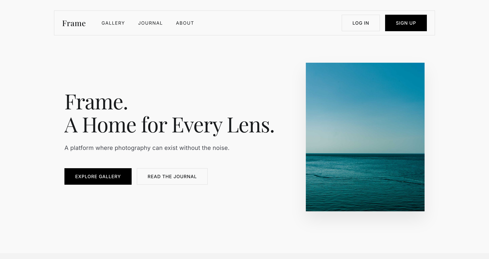
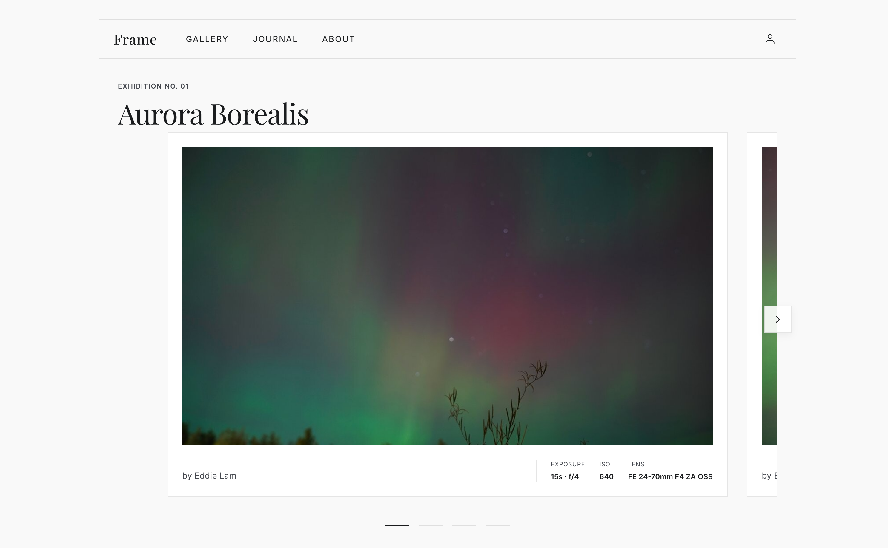
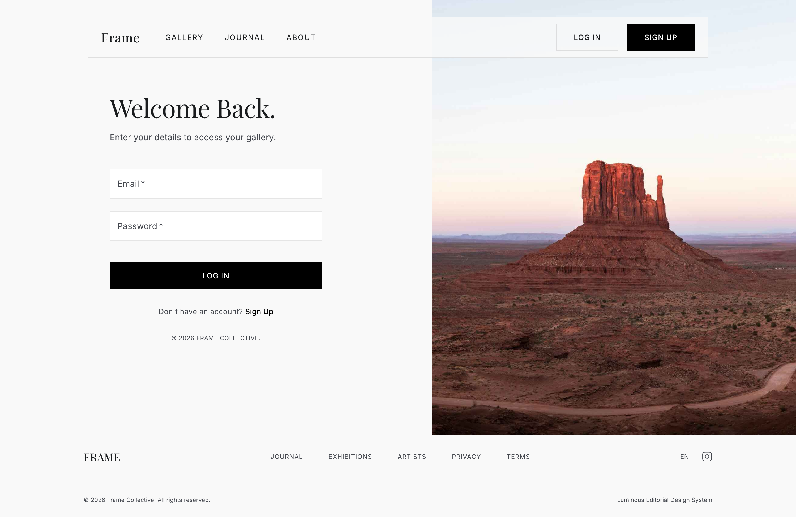

# Frame. A Home for Every Lens.

Frame is a sophisticated, photography-focused web platform designed to prioritize minimalism and high-fidelity visual storytelling. It provides a clean, distraction-free environment for photographers to showcase their portfolios, curate exhibitions, and manage their creative workspaces.

---

## Website Preview

### Home Page
Minimalist editorial landing page featuring typography combinations and a prominent featured artist showcase.


### Gallery Page
The core visual experience showcasing high-quality photography with inline EXIF metadata (exposure, ISO, lens).


### Login Page
Clean, distraction-free authentication interface designed with sharp outlines.


---

## Features

- **Modern Editorial Design**: Implements the "Luminous Editorial" design system with elegant typography (`Playfair Display` & `Inter`) and a sleek light-themed color palette.
- **Responsive Layout**: Fully responsive experience optimized across mobile, tablet, and high-resolution desktop displays.
- **Gallery Carousel**: A dedicated public gallery experience (`/gallery`) showcasing professional portfolios.
- **Studio Workspace**: A protected dashboard (`/studio`) where users can drag & drop, upload, title, describe, and publish galleries directly.
- **Metadata Integration**: Automatically reads and displays technical EXIF metadata for uploaded photos.
- **Premium Aesthetics**: Utilizes glassmorphism (backdrop blurs), smooth transitions, sharp borders, and subtle hover effects for a high-end editorial feel.

---

## Tech Stack

- **Framework**: [React 19](https://react.dev/) + [TypeScript](https://www.typescriptlang.org/)
- **Build Tool**: [Vite](https://vitejs.dev/)
- **Styling & UI**: [Material UI (MUI)](https://mui.com/) & [Emotion](https://emotion.sh/) & [Tailwind CSS](https://tailwindcss.com/)
- **Backend & Auth**: [Appwrite](https://appwrite.io/) (for authentication, databases, and object storage)
- **Routing**: [React Router](https://reactrouter.com/)

---

## Future Features & Roadmap

The following features and improvements are planned for upcoming releases:

### Journal Page
* **Concept**: A dedicated digital editorial/journal space for photographers to write articles, share behind-the-scenes stories, and document their creative processes.
* **Details**: Rich-text authoring workspace, story tags, and layouts designed to highlight long-form writing integrated seamlessly alongside high-resolution visual layouts.

### Updated Terms of Service (TOS)
* **Concept**: A robust legal and licensing framework for content creators and visitors.
* **Details**: Clarifications on photographer copyright ownership, public gallery usage rights, client review access guidelines, and updated terms for photo submissions and metadata sharing.

### Fix Front Page
* **Concept**: A complete overhaul of the homepage layout and content rendering.
* **Details**: Transitioning the landing page from static templates to dynamic loading of active/trending galleries, adding a rotating "Artist of the Week" spotlight section, and fine-tuning spacing, loading states, and animations for 4K displays.

### Add Studio Workshop Tab
* **Concept**: A new education and community hub located directly within the Studio Workspace.
* **Details**: Integrated tabs for interactive workshops, post-processing guides (lightroom/capture one presets, color theory), and private peer critique forums.

### Add Loading Indications (During Publish)
* **Concept**: Improved user feedback during gallery curation and publishing.
* **Details**: Implementation of a high-fidelity full-screen loader, a progress bar tracking image upload batches to Appwrite storage, and validation indicators to prevent users from leaving the page mid-upload.

### Solidify Website in General
* **Concept**: Codebase hardening, optimization, and stability improvements.
* **Details**: 
  - Writing thorough unit tests for core utilities and mock data configurations.
  - Adding comprehensive error boundary overlays to catch and handle network dropouts gracefully.
  - Optimizing asset delivery via modern formats (WebP/AVIF conversions on the fly) and lazy-loading offscreen image containers.

---

## Getting Started

### Prerequisites

- Node.js (v18 or higher recommended)
- npm or yarn

### Installation

1. **Clone the repository:**
   ```bash
   git clone <repository-url>
   cd project-photo
   ```

2. **Install dependencies:**
   ```bash
   npm install
   ```

3. **Configure Environment Variables:**
   Create a `.env` file in the root directory and add your Appwrite configurations:
   ```env
   VITE_APPWRITE_PROJECT_ID="your-project-id"
   VITE_APPWRITE_PROJECT_NAME="project-photo"
   VITE_APPWRITE_ENDPOINT="https://tor.cloud.appwrite.io/v1"
   VITE_APPWRITE_DATABASE_ID="your-database-id"
   VITE_APPWRITE_ARTISTS_COLLECTION_ID="users"
   VITE_APPWRITE_PHOTOS_COLLECTION_ID="photos"
   VITE_APPWRITE_BUCKET_ID="your-bucket-id"
   ```

4. **Start the development server:**
   ```bash
   npm run dev
   ```

5. **Open your browser:**
   Visit `http://localhost:5173` to explore the site locally.
