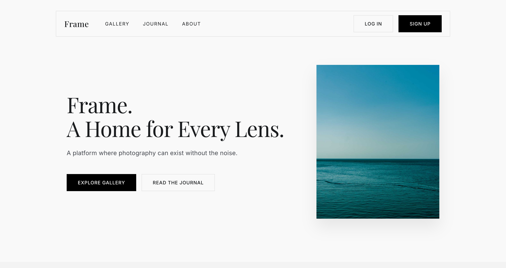
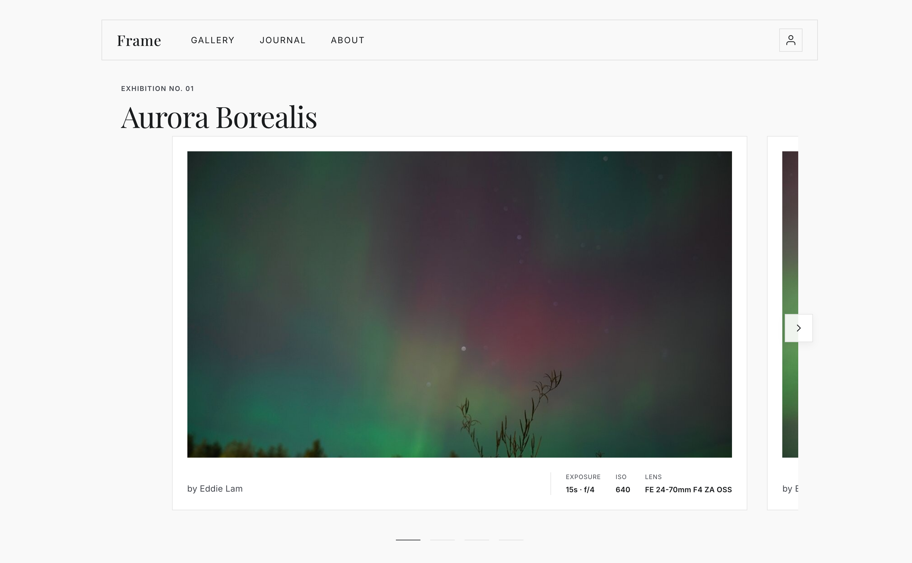
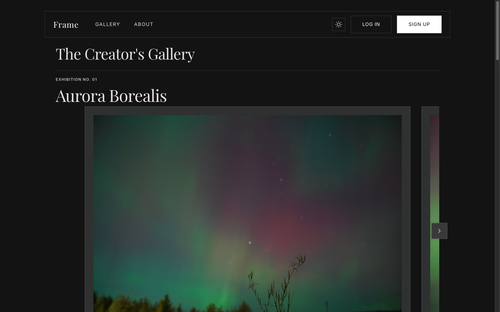
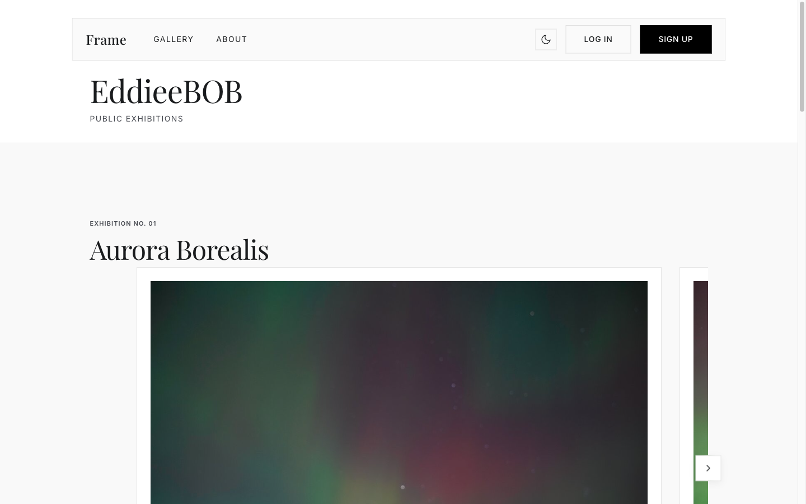
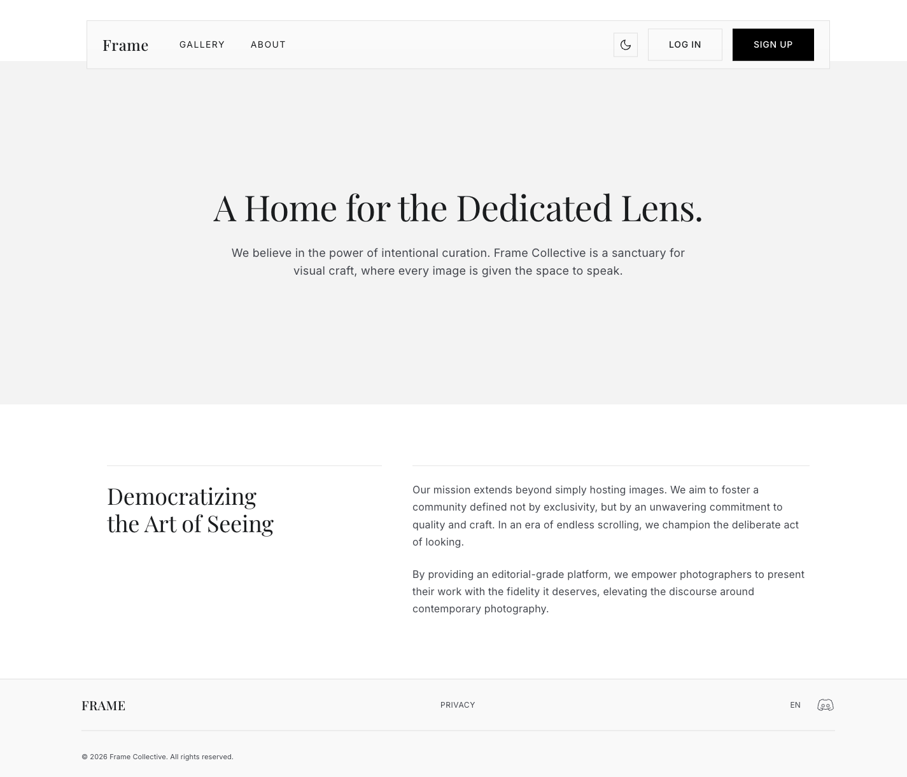
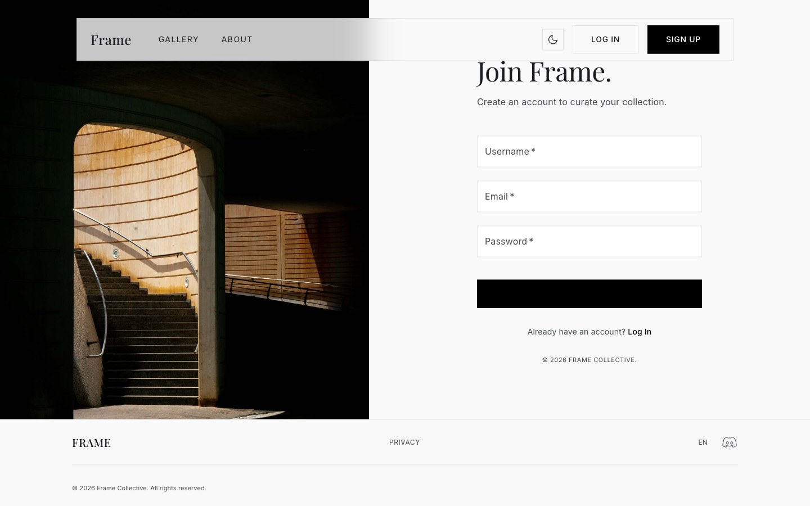
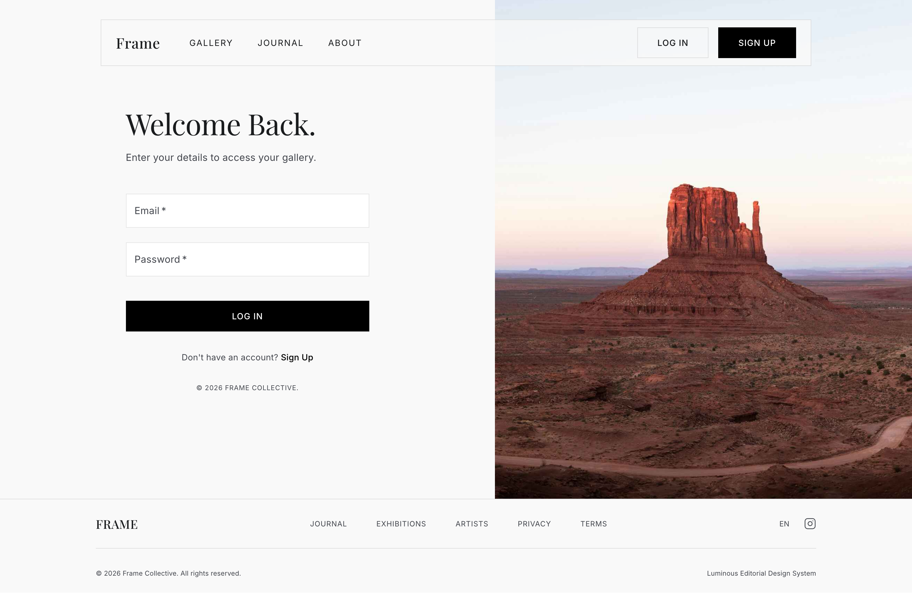
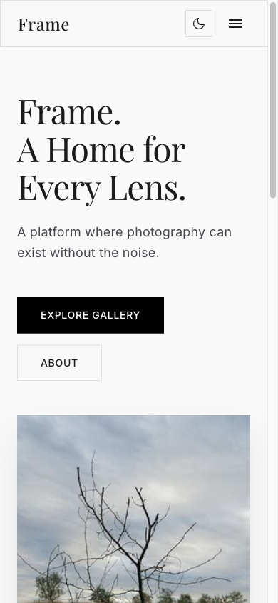

# Frame - A Home for Every Lens

**Live:** [photoframes.me](https://photoframes.me)

Frame is a photography-focused web platform built for minimalism and
high-fidelity visual storytelling. It gives photographers a clean,
distraction-free space to showcase portfolios, curate galleries, and manage
their creative workspace - with all authorization enforced server-side by
Appwrite.

---
### UI/UX Design 

> !!! The UI/UX is inspired and created by Goggle Sticth. I am neither artistcally gifted nor do I see anything wrong with a html webpage.

> ### ⚠️ This is a DEMO app - not for production use
> Use it at your own risk. I am not responsible for any data loss or security
> breaches. Security measures are implemented on Appwrite; see
> [docs/appwrite-backend.md](./docs/appwrite-backend.md).

---

## Preview

### Home Page
Minimalist editorial landing page with expressive typography and a featured-artist showcase.


### Gallery Page
The core visual experience - high-quality photography with inline EXIF metadata (exposure, ISO, lens), organized into curated exhibitions.


### Dark Mode
The full interface adapts to a persisted light/dark theme - here, the gallery at night.


### Public Profile
Every photographer gets a shareable public page at `/user/:username` listing their published exhibitions.


### About Page
Editorial "about" narrative that carries the same Luminous Editorial type and spacing.


### Authentication
Split-screen sign-up and login with username-only accounts, live password validation, and sharp outlines.

| Sign Up | Log In |
| --- | --- |
|  |  |

### Responsive
Fully responsive down to mobile, with a slide-out navigation drawer.



---

## Features
### Portfolio & Studio
- **Public gallery** (`/gallery`) - a horizontal carousel showcasing published
  portfolios.
- **Public profiles** (`/user/:username`) - per-photographer pages resolved by
  username.
- **Studio workspace** (`/studio`, protected) - drag-and-drop upload, title,
  describe, and publish galleries directly.
- **Client-side image pipeline** - uploads are resized with
  [`pica`](https://github.com/nodeca/pica) and their EXIF metadata is read with
  [`exifr`](https://github.com/MikeKovarik/exifr) before storage.

### Authentication & security
- **Email/password auth** with email verification and password reset flows.
- **Login by username** - a server-side [`login-resolver`](./functions/login-resolver/README.md)
  Appwrite Function resolves username → email *after* verifying the password, so
  no one's email is ever exposed to the browser.
- **Two-factor authentication** - email-OTP 2FA (a 6-digit code emailed at
  login), enrolled and challenged through Appwrite MFA.
- **Row/file-level authorization** - private galleries stay private and public
  ones are readable by anyone, enforced by Appwrite permissions rather than
  client code (closes IDOR / "private is actually public" gaps). See
  [docs/appwrite-backend.md](./docs/appwrite-backend.md).

---

## Tech Stack

| Area | Choice |
| --- | --- |
| Framework | [React 19](https://react.dev/) + [TypeScript](https://www.typescriptlang.org/) (with the React Compiler) |
| Build tool | [Vite](https://vitejs.dev/) |
| Styling & UI | [MUI](https://mui.com/) + [Emotion](https://emotion.sh/) + [Tailwind CSS v4](https://tailwindcss.com/) |
| Backend, auth & storage | [Appwrite](https://appwrite.io/) (Cloud + Sites) |
| Routing | [React Router 7](https://reactrouter.com/) |
| i18n | [i18next](https://www.i18next.com/) / react-i18next |
| Images | [pica](https://github.com/nodeca/pica) (resize), [exifr](https://github.com/MikeKovarik/exifr) (EXIF) |
| Testing | [Vitest](https://vitest.dev/) (unit + integration), [Playwright](https://playwright.dev/) (E2E) |

---

## Architecture

Frame is a **frontend-only SPA that talks directly to Appwrite** - there is no
custom app server. The only server-side code is a single Appwrite Function
(`login-resolver`). Because the browser calls Appwrite directly, **all access
control lives in Appwrite's row/file permissions**, not in the React code.

```
project-photo/
├── src/
│   ├── pages/          # Route screens (Hero, Gallery, StudioWorkspace, Login, …)
│   ├── components/     # NavBar, carousels, ProtectedRoute, ErrorBoundary, …
│   ├── services/       # authService, loginService, signupService, photoService
│   ├── contexts/       # AuthContext, ThemeContext
│   ├── lib/            # appwrite client + permissions helpers
│   ├── utils/          # password strength, misc
│   └── i18n.ts         # i18next setup
├── functions/
│   └── login-resolver/ # Appwrite Function: username → email (server-side)
├── tests/              # unit + integration (Vitest), e2e + 2FA (Playwright)
├── docs/               # project documentation (see docs/README.md)
├── appwrite.config.json # Appwrite tables/bucket/function config
└── public/             # static assets, _headers, robots.txt
```

### Routes

| Path | Access | Purpose |
| --- | --- | --- |
| `/` | Public | Home / hero + feature cards |
| `/gallery` | Public | Public portfolio carousel |
| `/user/:username` | Public | Photographer's public profile |
| `/about` | Public | About page |
| `/login`, `/signup` | Public | Authentication |
| `/verify`, `/forgot-password`, `/reset` | Public | Email verification & password reset |
| `/studio` | Protected | Upload & manage galleries |
| `/account` | Protected | Account settings |

---

## Scripts

| Script | Description |
| --- | --- |
| `npm run dev` | Start the Vite dev server |
| `npm run build` | Type-check (`tsc -b`) and build for production |
| `npm run preview` | Preview the production build |
| `npm run lint` | Run ESLint |
| `npm test` | Unit tests (offline, deterministic) |
| `npm run test:integration` | Integration tests against the live Appwrite project |
| `npm run test:all` | All Vitest suites |
| `npm run test:e2e` | Playwright browser E2E (`:ui` for interactive mode) |
| `npm run test:e2e:2fa` | 2FA email-OTP lifecycle suite |
| `npm run e2e:mailpit:up` / `:down` | Bring the local Mailpit stack up/down for automated OTP tests |

---

## Testing

Three layers - full details in [tests/README.md](./tests/README.md):

- **Unit** ([Vitest](https://vitest.dev/)) - offline, deterministic coverage of
  the security-critical pure logic (password rules, the per-document permission
  builder).
- **Integration** (Vitest) - live client-side tests against the real Appwrite
  project: auth email flows and a full gallery/photo/file lifecycle (create →
  guest-can't-read → owner-can → publish → delete).
- **E2E** ([Playwright](https://playwright.dev/)) - real-browser coverage of
  public pages, navigation, theme toggle, auth UI, and the full upload pipeline.
  The **[2FA lifecycle suite](./tests/e2e/2fa/README.md)** runs email-OTP login
  end-to-end against a local Appwrite + [Mailpit](./tests/e2e/2fa/docker/README.md)
  stack, reading the OTP back over Mailpit's API - fully automated, no human.

---

## Documentation

All project docs live in **[docs/](./docs/README.md)**:

- [Appwrite backend & security model](./docs/appwrite-backend.md)
- [`login-resolver` function](./functions/login-resolver/README.md)
- [Testing overview](./tests/README.md) · [2FA E2E](./tests/e2e/2fa/README.md) · [Local Mailpit stack](./tests/e2e/2fa/docker/README.md)
- [Design system - Luminous Editorial](./docs/design/luminous-editorial.md) · [Auth patterns](./docs/design/auth-patterns.md)

---

## Roadmap

Planned:
- [ ] thumhash pre-rendering for photos
- [ ] new gallery page from [suped-project-photo](https://github.com/EddieeBOB/suped-project-photo)

## License

Demo / educational project. Use at your own risk.


